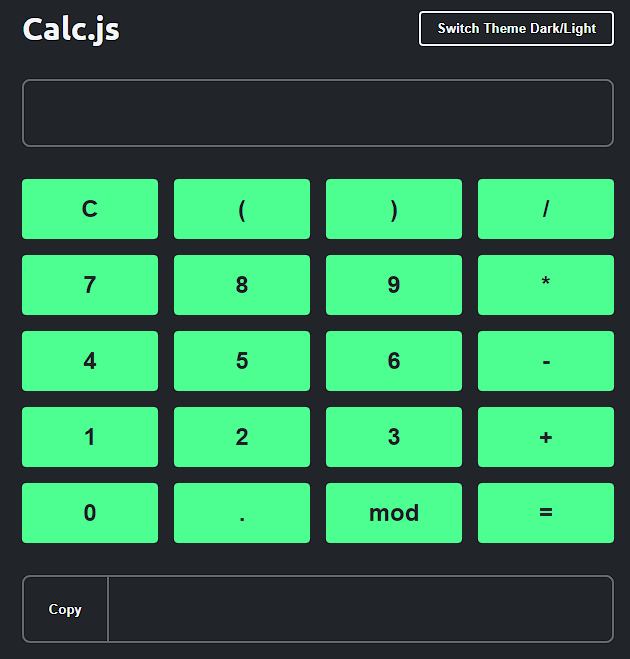

# Calculadora 2.0 (Front-end)

## Descrição
A Calculadora 2.0 é uma aplicação web que oferece funcionalidades avançadas de uma calculadora, incluindo operações matemáticas complexas e uma interface moderna. Este projeto foi desenvolvido como parte do meu aprendizado em desenvolvimento web.

## Funcionalidades Principais
- Suporte a operações matemáticas básicas (adição, subtração, multiplicação e divisão).
- Funcionalidades avançadas, como potenciação, radiciação e porcentagem.
- Interface moderna e intuitiva.
- Responsiva, adaptando-se a diferentes dispositivos.

## Tecnologias Utilizadas
- HTML5
- CSS3 (com pré-processador SASS/SCSS)
- JavaScript (possivelmente utilizando frameworks como React, Vue.js, ou Angular)
- Git (para controle de versão)

## Como Utilizar
1. Clone o repositório (`git clone https://github.com/AngeloHervis/Calculadora-2.0-Front-end.git`).
2. Abra o arquivo `index.html` em seu navegador web.
3. Utilize os botões da calculadora para realizar cálculos.

## Autor
Angelo Hervis
- GitHub: [AngeloHervis](https://github.com/AngeloHervis)
- LinkedIn: [Angelo Hervis](https://www.linkedin.com/in/angelohervis/)

